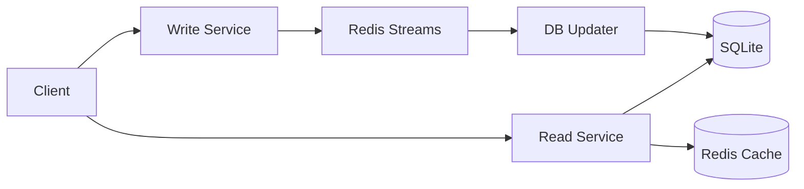

# Twitter Clone Microservices

A Twitter clone implementation using microservices architecture, featuring high-performance data processing and caching.

## Architecture

### Services
- **Read Service**: Handles all read operations with Redis caching
- **Write Service**: Manages write operations through Redis Streams
- **DB Updater**: Processes messages from Redis Streams and updates SQLite database

### Technology Stack
- **API Framework**: FastAPI
- **Database**: SQLite
- **Message Broker**: Redis Streams
- **Cache**: Redis
- **Container**: Docker

## System Design



### Data Flow
1. **Write Path**:
   - Client → Write Service
   - Write Service → Redis Streams
   - DB Updater → SQLite Database

2. **Read Path**:
   - Client → Read Service
   - Read Service → Redis Cache (if cached)
   - Read Service → SQLite Database (if cache miss)

## Getting Started

### Prerequisites
- Docker and Docker Compose
- Python 3.9+
- Redis Server (for local development)

### Installation

1. Clone the repository
```bash
git clone <repository-url>
cd twitter-clone
```

2. Create virtual environment (optional)
```bash
python -m venv venv
source venv/bin/activate  # Linux/Mac
# or
.\venv\Scripts\activate  # Windows
```

3. Install dependencies
```bash
pip install -r requirements.txt
```

### Running the Services

#### Using Docker Compose (Recommended)
```bash
# Build and start all services
docker-compose up --build

# Run in background
docker-compose up -d
```

#### Local Development
```bash
# Initialize the database with test data
python script/init_db.py

# Start all services
./script/test_services.sh
```

## API Endpoints

### Write Service (Port 8001)
- `POST /tweets` - Create a new tweet
- `POST /users` - Create a new user
- `POST /tweets/{tweet_id}/like` - Like a tweet
- `POST /tweets/{tweet_id}/retweet` - Retweet a tweet

### Read Service (Port 8000)
- `GET /tweets/{tweet_id}` - Get a specific tweet
- `GET /users/{user_id}/tweets` - Get user's tweets

## Development

### Project Structure
```
twitter-clone/
├── common/
│   ├── models.py      # Shared data models
│   ├── database.py    # Database utilities
│   └── cache.py       # Redis cache utilities
├── services/
│   ├── read/          # Read service
│   ├── write/         # Write service
│   └── db-updater/    # Database updater service
├── script/
│   ├── init_db.py     # Database initialization
│   └── test_services.sh # Local development runner
├── docker-compose.yml
└── requirements.txt
```

### Environment Variables
- `REDIS_URL`: Redis connection URL (default: redis://localhost:6379)
- `DATABASE_URL`: SQLite database path (default: ./data/twitter.db)

## Testing

```bash
# Run unit tests
pytest

# Run integration tests
pytest tests/integration
```

## Performance Considerations

- Redis cache for frequently accessed tweets
- Message queuing for write operations
- Batch processing of database updates
- Indexed database queries for optimal read performance

## Contributing

1. Fork the repository
2. Create your feature branch (`git checkout -b feature/amazing-feature`)
3. Commit your changes (`git commit -m 'Add amazing feature'`)
4. Push to the branch (`git push origin feature/amazing-feature`)
5. Open a Pull Request

## License

This project is licensed under the MIT License - see the LICENSE file for details.